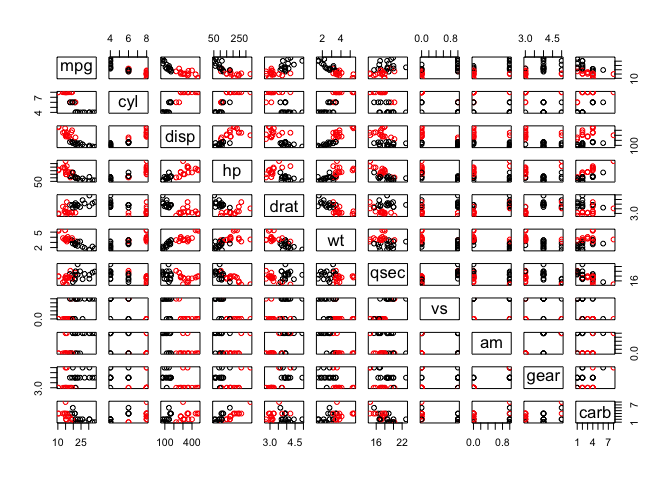

KModes Clustering Using Gower Distance
--------------------------------------

Most clustering examples use simple datasets with all numeric features.
But what if you need to cluster a dataset with mixed features? Gower
distance is a distance metric that tries to generalize similarity across
different types of features.

    x1 <- data.frame(a="cat", b=1, c=TRUE, stringsAsFactors=FALSE)
    x2 <- data.frame(a="dog", b=0.9, c=FALSE, stringsAsFactors=FALSE)
    x3 <- data.frame(a="goat", b=0.8, c=FALSE, stringsAsFactors=FALSE)

    gower_dist(x1, rbind(x1, x2, x3))

    ## [1] 0.0000000 0.8333333 1.0000000

KModes
------

Unlike KMeans, KModes uses the modes of each cluster rather than the
average. For categorical data, this means taking the value that appears
the most often. For numeric data, this is the median value. If there is
a tie for the most frequent value, the first one is taken.

    cats <- c("cyl","vs","am","gear","carb")
    mtcars[cats] <- lapply(mtcars[cats], factor)

    km <- kmodes_gower(mtcars, 3)

    ## Iter   % Changed Cluster
    ##   1              34.38
    ##   2              28.12
    ##   3              15.62
    ##   4               3.12
    ##   5               9.38
    ##   6               9.38
    ##   7               0.00

    show(km)

    ## K-modes clustering with 3 clusters of sizes 14, 6, 12
    ## 
    ## Cluster modes:
    ##     mpg cyl   disp    hp  drat     wt  qsec vs am gear carb
    ## 1 15.35   8 350.50 180.0 3.075 3.7550 17.35  0  0    3    4
    ## 2 21.00   6 152.50 111.5 3.835 2.6950 16.58  0  1    5    2
    ## 3 22.80   4 120.55  94.0 3.920 2.6225 19.17  1  0    4    1
    ## 
    ## Within cluster sum of distances by cluster
    ## [1] 2.627523 1.683822 3.056213
    ## 
    ##  within_dist / total_dist = 65.9 %)

    plot(mtcars, col=km$clusters)

Prediction Methods
------------------

Once a dataset is cluster with `kmodes_gower` the resulting object can
be used for predictions on new data. There are two kinds of predictions:
Clusters and Distance. `cluster` returns the index of the nearest
cluster for each record of the input dataset. `distance` returns a
matrix with `K` columns each containing the gower distance between the
input records and each mode. The argument `normalize` determines whether
the rows of the distance matrix should sum to one.

    cluster <- predict(km, mtcars) # default returns clusters
    table(cluster)

    ## cluster
    ##  1  2 
    ## 24  8

    d1 <- predict(km, mtcars, type="distance", normalize=FALSE)
    d2 <- predict(km, mtcars, type="distance", normalize=TRUE)

    head(d1)

    ##           [,1]      [,2]      [,3]
    ## [1,] 0.4308455 0.1897659 0.4149101
    ## [2,] 0.4188575 0.1956697 0.4146606
    ## [3,] 0.6457625 0.4179481 0.1101008
    ## [4,] 0.3749739 0.4642582 0.2754273
    ## [5,] 0.1216643 0.3998524 0.5343441
    ## [6,] 0.3870310 0.4955948 0.3066464

    head(d2)

    ##           [,1]      [,2]       [,3]
    ## [1,] 0.4160662 0.1832563 0.40067748
    ## [2,] 0.4069787 0.1901205 0.40290081
    ## [3,] 0.5501416 0.3560607 0.09379769
    ## [4,] 0.3364022 0.4165023 0.24709549
    ## [5,] 0.1152276 0.3786980 0.50607434
    ## [6,] 0.3254352 0.4167211 0.25784372
